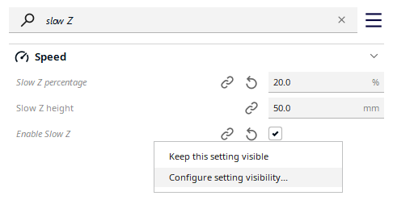

## Fast Bottom Infill

This Plugin is plagiarized from an initial existing Cura Plugin : [Cura-Slow-Z](https://github.com/5axes/Cura-Slow-Z) by [5axes](https://github.com/5axes)

Cura uses the same speed for top and bottom layers infill.
This plugin adds a setting named "Enable Bottom Layers Infill" to the speed settings in the Custom print setup of Cura. It allows for a specific speed for initial and bottom layers infill.

This is usefull when using tri-hexagon infill at less than 50%, as the holes need a very small for the roof speed to be filled, but the bottom layers still can be printed fast.

These settings can be found in the Custom print setup by using the Search field on top of the settings. If you want to make the setting permanently visible in the sidebar, right click and select "Keep this setting visible".

## Options

        Enable Bottom Layers Infill : Activate plugin.
        Initial Layer Infill Speed : Initial Layer Infill Speed.
        Bottom Layers Infill Speed : Bottom Layers Infill Speed
